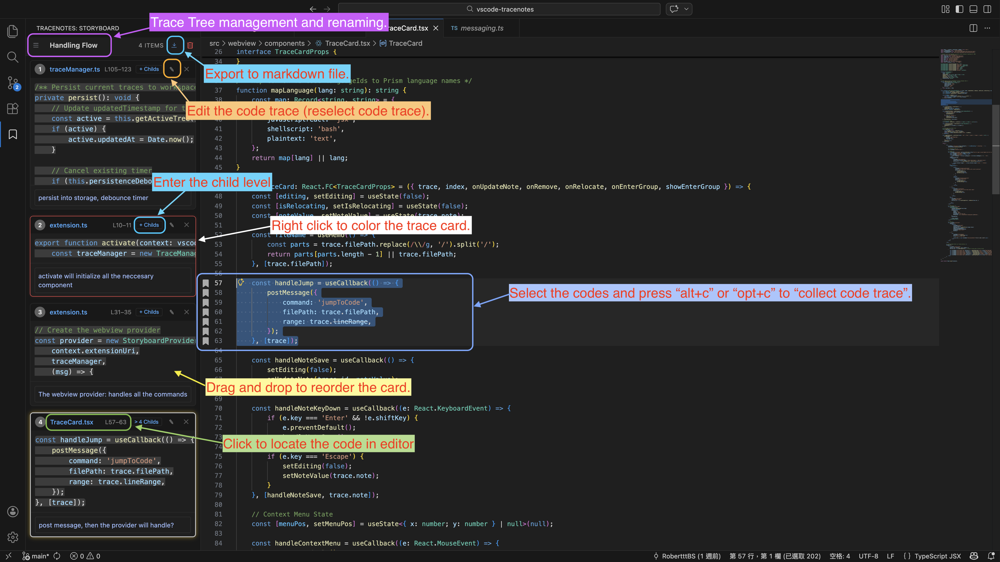

# TraceNotes

> An extension for code tracing and note-taking that supports exporting and importing in Markdown format.

### Select the code and press **`Opt+C`** or **`Alt+C`** to collect traces; the rest is intuitive.



TraceNotes is an extension for navigating and documenting code logic. It allows you to build a structured narrative of code flows that stay synchronized with the editor.

## Features

### Trace Collection

- **Capture** – Select code and press `Opt+C` or `Alt+C` to create a trace point.
- **Indentation Correction** – Automatically removes leading indentation from collected snippets based on the selection.
- **Recovery** – Trace points attempt to maintain their position when files are modified, though accuracy may vary depending on the extent of the changes.

### Markdown Portability

- **Export** – Save collected traces to a Markdown file. The export preserves the hierarchy using standard Markdown headings.
- **Import** – Load trace data back into the extension from supported Markdown documents.

### Additional Capabilities

- **Organization** – Group traces into levels (up to 10 levels deep), manage multiple trace trees, and reorder cards via drag and drop.
- **Synchronization** – Link trace cards to source lines for bi-directional navigation. Cursor movement highlights associated cards.
- **Visual Markers** – Assign colors to traces to highlight sidebar cards and editor gutter positions.
- **Annotations** – Add notes to individual trace points to provide context.

---

## Usage

### Collecting Traces

Select code in the editor and press **`Opt + C`** (macOS) or **`Alt + C`** (Windows). The snippet is added as a card in the sidebar storyboard.

### Markdown Export & Import

- **Export**: Click the **Export** icon in the sidebar header to generate a `.md` file.
- **Import**: Use the import command to restore a trace tree from a previously exported file.

### Organization & Management

- **Nesting**: Click **"+ Childs"** on a card to enter a nested level. Traces added here become children of that card.
- **Navigation**: Click a card to jump to its location. Use breadcrumbs to move between levels.
- **Reorder**: Drag and drop cards to change the sequence within the current level.
- **Update**: Use the context menu on a card to **Relocate** it to a new selection or assign a **Highlight** color.

---

## Commands & Shortcuts

| Action            | Shortcut (macOS) | Shortcut (Win/Linux) | Command                            |
| :---------------- | :--------------- | :------------------- | :--------------------------------- |
| **Collect Trace** | `Option + C`     | `Alt + C`            | `TraceNotes: Collect Trace`        |
| **Export MD**     | —                | —                    | `TraceNotes: Export to Markdown`   |
| **Import MD**     | —                | —                    | `TraceNotes: Import from Markdown` |
| **Clear Current** | —                | —                    | `TraceNotes: Clear All Traces`     |

---

## Project Structure

```text
src/
├── extension.ts        # Entry point and command routing
├── traceManager.ts     # State management and recovery logic
├── collector.ts        # Snippet extraction and indentation handling
├── decorationManager.ts# Editor visual sync
├── exporter.ts         # Markdown generation
└── webview/            # Sidebar UI
```

---

## License

Distributed under the **MIT License**.
